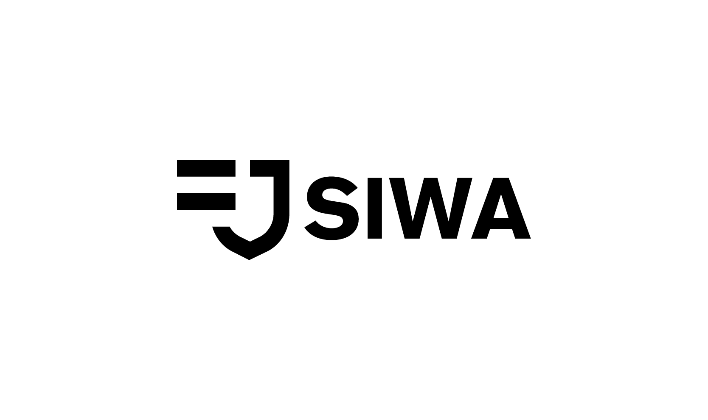

# Sign-In with Algorand

<figure><figcaption>
SIWA typelogo
</figcaption></figure>

Sign-In with Algorand is a new form of authentication that enables users to control their digital identity with their Algorand account instead of relying on a traditional intermediary. Already used by multiple projects in the Algorand ecosystem, this effort standardizes the method with best practices and makes it easy to adopt securely.

To hop right in, check out our Quickstart Guide.


[quickstart-guide](sign-in-with-algorand/quickstart-guide/)


### Integrate Sign-In with Algorand


[typescript.md](libraries/typescript.md)


### Additional Support


[nfd-profile-resolution.md](additional-support/nfd-profile-resolution.md)


### Additional Resources

Sign-in With Algorand was a standard built collaboratively with the greater Algorand community. For more information on the specification, check out the following page:


[eip-4361-compat.md](general-information/siwa-overview/eip-4361-compat.md)


For more information on Sign-In with Algorand and its related benefits to both the Algorand ecosystem and Web2 services, check out the following page:


[siwa-overview](general-information/siwa-overview/)


### Community

* [SIWA.org](https://siwa.org) - Check out the Sign-In with Algorand home page for more information about supporters, and recent activity.
* [Discord](https://discord.com/invite/algorand) - Join the Algorand Discord Server for general Algorand developer support.
