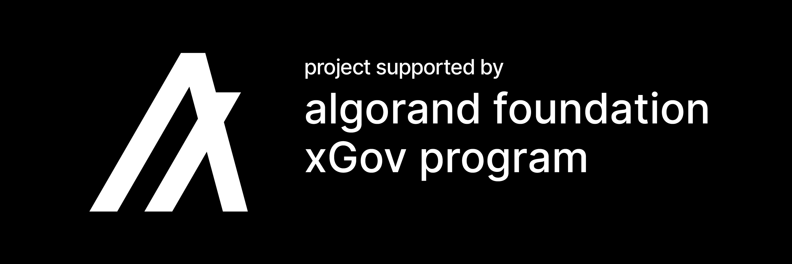

# Attribution and Recognition

### Attribution

"Sign In With Algorand" (SIWA) draws inspiration from and builds upon the foundational ideas established by other blockchain-based authentication protocols. These pioneering projects have shaped the evolution of decentralized authentication and informed the development of SIWA for the Algorand ecosystem.

#### SIWE (Sign-In with Ethereum)

SIWE, developed by [Spruce Systems, Inc.](https://login.xyz), introduced the concept of using blockchain wallets for decentralized authentication. This protocol allows Ethereum users to authenticate securely by signing a message with their private key. SIWA adopts many of SIWE’s core principles, adapting them to Algorand’s high-performance blockchain while addressing unique ecosystem requirements.

#### SIWS (Sign-In with Substrate)

[SIWS](https://github.com/TalismanSociety/siws) extends blockchain-based authentication to the Substrate ecosystem, which powers many parachains in the Polkadot and Kusama networks. While SIWA is tailored to Algorand, it shares SIWS’ goals of enabling secure and user-friendly authentication for blockchain users.

#### SIWS (Sign-In with Solana)

The Solana ecosystem has also embraced blockchain-based authentication through SIWS. By leveraging the high-speed capabilities of Solana’s blockchain, this protocol provides decentralized authentication optimized for its network. SIWA takes inspiration from this implementation to adapt to Algorand’s unique architecture and functionality. For more information, visit [Phantom’s GitHub repository](https://github.com/phantom).

#### Acknowledgment of Contributions

We acknowledge the foundational contributions of these projects to the decentralized authentication ecosystem. By building on their innovations, SIWA extends these concepts to Algorand, enabling developers to leverage the benefits of a secure, decentralized, and user-centric authentication mechanism.

***

### Recognition

This project has been made possible through the support of the **Algorand Foundation**. Specifically, SIWA has been developed under the guidance and funding provided by the **Algorand Foundation xGov Grants Program**.

We extend our gratitude to the Algorand Foundation for their commitment to fostering innovation and expanding the Algorand ecosystem. Their support has been instrumental in the development and dissemination of SIWA.

<figure><figcaption>
xGov Award Badge
</figcaption></figure>
