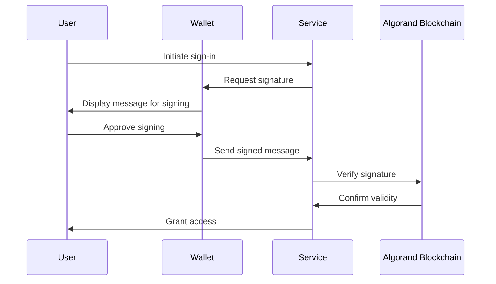

# EIP-4361-COMPAT


This document lays out SIWA's approach to adopting an authentication standard for Algorand, based on Ethereum's EIP-4361. This may be replaced with a formal ARC in the future.


### Abstract

Sign-In with Algorand describes how Algorand accounts authenticate with off-chain services by signing a standard message format parameterized by scope, session details, and security mechanisms (e.g., a nonce). The goals of this specification are to provide a self-custodied alternative to centralized identity providers, improve interoperability across off-chain services for Algorand-based authentication, and provide wallet vendors a consistent machine-readable message format to achieve improved user experiences and consent management.

### Motivation

When signing in to popular non-blockchain services today, users typically use identity providers (IdPs) that are centralized entities with ultimate control over users' identifiers, for example, large internet companies and email providers. Incentives are often misaligned between these parties. Sign-In with Algorand offers a new self-custodial option for users who wish to assume more control and responsibility over their own digital identity.

Already, many services support workflows to authenticate Algorand accounts using message signing, such as to establish a cookie-based web session which can manage privileged metadata about the authenticating address. This is an opportunity to standardize the sign-in workflow and improve interoperability across existing services, while also providing wallet vendors a reliable method to identify signing requests as Sign-In with Algorand requests for improved UX.

### Specification

Sign-In with Algorand works as follows:

1. The wallet presents the user with a structured plaintext message or equivalent interface for signing. The message MUST incorporate an Algorand address, domain requesting the signing, version of the message, a chain identifier chain-id, URI for scoping, nonce acceptable to the server, and issued-at timestamp.
2. The signature is then presented to the server, which checks the signature's validity and message content.
3. Additional fields, including expiration-time, not-before, request-id, chain-id, and resources may be incorporated as part of authentication for the session.
4. The server may further fetch data associated with the Algorand address, such as from the Algorand blockchain (e.g., account balances, ASA ownership), or other data sources that may or may not be permissioned.

#### Example message to be signed

```
service.org wants you to sign in with your Algorand account:
AAAAAAAAAAAAAAAAAAAAAAAAAAAAAAAAAAAAAAAAAAAAAAAAAAAAAAAAAAAAAAAA

I accept the ServiceOrg Terms of Service: https://service.org/tos

URI: https://service.org/login
Version: 1
Chain ID: 416001
Nonce: 32891756
Issued At: 2021-09-30T16:25:24Z
Resources:
- ipfs://bafybeiemxf5abjwjbikoz4mc3a3dla6ual3jsgpdr4cjr3oz3evfyavhwq/
- https://example.com/my-web2-claim.json
```

#### Informal Message Template

A Bash-like informal template of the full message is presented below for readability and ease of understanding. Field descriptions are provided in the following section.

```
${domain} wants you to sign in with your Algorand account:
${address}

${statement}

URI: ${uri}
Version: ${version}
Chain ID: ${chain-id}
Nonce: ${nonce}
Issued At: ${issued-at}
Expiration Time: ${expiration-time}
Not Before: ${not-before}
Request ID: ${request-id}
Resources:
- ${resources[0]}
- ${resources[1]}
...
- ${resources[n]}
```

#### Message Field Descriptions

* `authority` is the RFC 3986 authority that is requesting the signing.
* `address` is the Algorand address performing the signing.
* `statement` (optional) is a human-readable ASCII assertion that the user will sign, and it must not contain '\n' (the byte 0x0a).
* `uri` is an RFC 3986 URI referring to the resource that is the subject of the signing (as in the subject of a claim).
* `version` is the current version of the message, which MUST be 1 for this specification.
* `chain-id` is the Chain ID to which the session is bound, and the network where the Algorand account must be resolved.
* `nonce` is a randomized token used to prevent replay attacks, at least 8 alphanumeric characters.
* `issued-at` is the ISO 8601 datetime string of the current time.
* `expiration-time` (optional) is the ISO 8601 datetime string that, if present, indicates when the signed authentication message is no longer valid.
* `not-before` (optional) is the ISO 8601 datetime string that, if present, indicates when the signed authentication message will become valid.
* `request-id` (optional) is a system-specific identifier that may be used to uniquely refer to the sign-in request.
* `resources` (optional) is a list of information or references to information the user wishes to have resolved as part of authentication by the relying party. They are expressed as RFC 3986 URIs separated by "\n- ".

### Signing and Verifying with Algorand Accounts

For Algorand accounts, the verification method specified in the Algorand SDK MUST be used. This involves using the `algosdk.verifyBytes` function to check the signature against the message and the Algorand address.

### Server-Side (Relying Party) Implementer Guidelines

#### Verifying a signed message

The message MUST be checked for conformance to the ABNF above, checked against expected term values after parsing, and its signature must be verified using the Algorand SDK.

#### Creating sessions

Sessions MUST be bound to the Algorand address and not to further resolved resources that may change.

#### Interpreting and resolving resources

The listed resources must be RFC 3986 URIs, but their interpretation is out of scope of this specification. Implementers SHOULD ensure that URIs are human-friendly when expressed in plaintext form.

### Wallet Implementer Guidelines

#### Verifying message

The full message MUST be checked for conformance to the ABNF above. Wallet implementers SHOULD warn users if the substring "wants you to sign in with your Algorand account" appears anywhere in a message signing request unless the message fully conforms to the format defined in this specification.

#### Verifying domain binding

Wallet implementers MUST prevent phishing attacks by matching on the domain term when processing a signing request. For example, when processing the message beginning with "service.invalid wants you to sign in...", the wallet checks that the request actually originated from service.invalid.

#### Creating Sign-In with Algorand interfaces

Wallet implementers MUST display to the user the following terms from the Sign-In with Algorand signing request by default and prior to signing, if they are present: domain, address, statement, and resources. Other present terms MUST also be made available to the user prior to signing either by default or through an extended interface.

### Security Considerations

#### Identifier reuse

To enhance privacy, it would be ideal to use a new uncorrelated identifier (e.g., Algorand address) per digital interaction, selectively disclosing the information required and no more. This concern is less relevant to certain user demographics who are likely to be early adopters of this specification, such as those who manage an Algorand address intentionally associated with their public presence.

#### Key management

Sign-In with Algorand gives users control through their keys. This is additional responsibility that mainstream users may not be accustomed to accepting, and key management is a hard problem especially for individuals. For example, there is no "forgot password" button as centralized identity providers commonly implement.

#### Wallet and server combined security

Both the wallet and server must implement this specification for improved security to the end user. Specifically, the wallet MUST confirm that the message is for the correct domain or provide the user means to do so manually.

#### Preventing replay attacks

A nonce should be selected per session initiation with enough entropy to prevent replay attacks, a man-in-the-middle attack in which an attacker is able to capture the user's signature and resend it to establish a new session for themselves.

#### Channel security

For web-based applications, all communications SHOULD use HTTPS to prevent man-in-the-middle attacks on the message signing. When using protocols other than HTTPS, all communications SHOULD be protected with proper techniques to maintain confidentiality, data integrity, and sender/receiver authenticity.

#### Role Diagram


