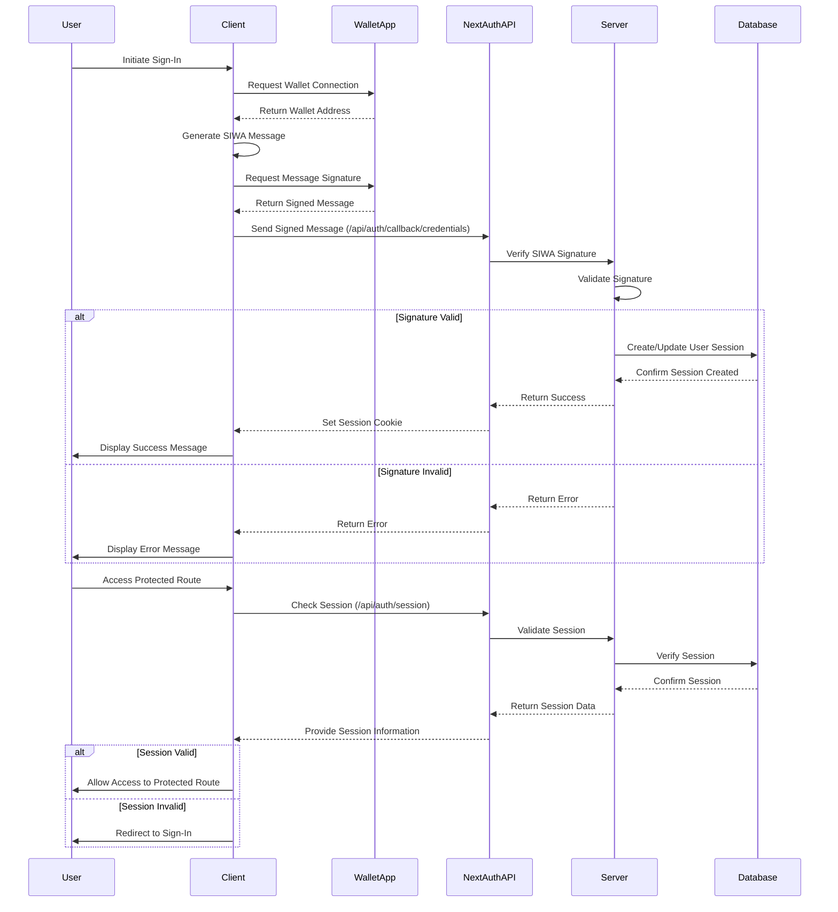

# Extended SIWA Diagram

```mermaid
sequenceDiagram
    participant User
    participant Client
    participant WalletApp
    participant NextAuthAPI
    participant Server
    participant Database

    User->>Client: Initiate Sign-In
    Client->>WalletApp: Request Wallet Connection
    WalletApp-->>Client: Return Wallet Address
    Client->>Client: Generate SIWA Message
    Client->>WalletApp: Request Message Signature
    WalletApp-->>Client: Return Signed Message
    Client->>NextAuthAPI: Send Signed Message (/api/auth/callback/credentials)
    NextAuthAPI->>Server: Verify SIWA Signature
    Server->>Server: Validate Signature
    alt Signature Valid
        Server->>Database: Create/Update User Session
        Database-->>Server: Confirm Session Created
        Server-->>NextAuthAPI: Return Success
        NextAuthAPI-->>Client: Set Session Cookie
        Client->>User: Display Success Message
    else Signature Invalid
        Server-->>NextAuthAPI: Return Error
        NextAuthAPI-->>Client: Return Error
        Client->>User: Display Error Message
    end
    User->>Client: Access Protected Route
    Client->>NextAuthAPI: Check Session (/api/auth/session)
    NextAuthAPI->>Server: Validate Session
    Server->>Database: Verify Session
    Database-->>Server: Confirm Session
    Server-->>NextAuthAPI: Return Session Data
    NextAuthAPI-->>Client: Provide Session Information
    alt Session Valid
        Client->>User: Allow Access to Protected Route
    else Session Invalid
        Client->>User: Redirect to Sign-In
    end
```
