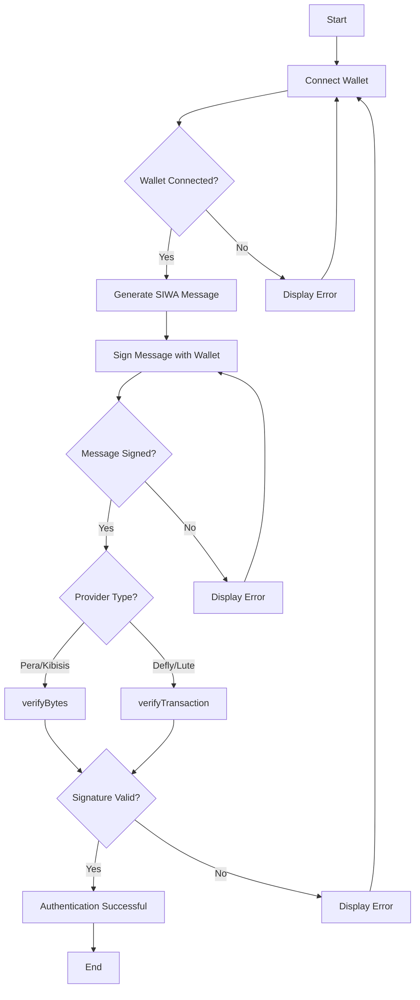

# SIWA Diagram

```mermaid
graph TD
    A["Start"] --> B["Connect Wallet"]
    B --> C{"Wallet Connected?"}
    C -->|Yes| D["Generate SIWA Message"]
    C -->|No| E["Display Error"]
    E --> B
    D --> F["Sign Message with Wallet"]
    F --> G{"Message Signed?"}
    G -->|Yes| H{"Provider Type?"}
    G -->|No| I["Display Error"]
    I --> F
    H -->|Pera/Kibisis| J["verifyBytes"]
    H -->|Defly/Lute| K["verifyTransaction"]
    J --> L{"Signature Valid?"}
    K --> L
    L -->|Yes| M["Authentication Successful"]
    L -->|No| N["Display Error"]
    N --> B
    M --> O["End"]
```
