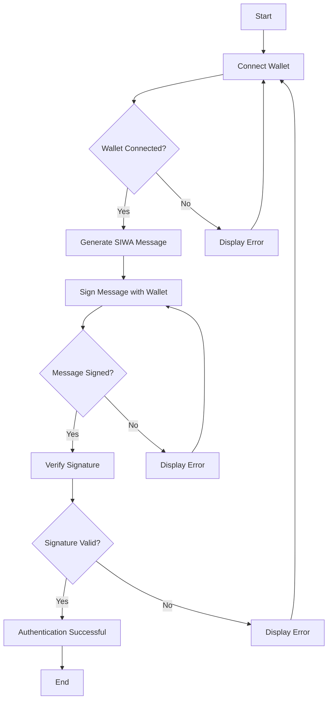

# Sign-in Diagram

```mermaid
graph TD
    A["Start"] --> B["Connect Wallet"]
    B --> C{"Wallet Connected?"}
    C -->|Yes| D["Generate SIWA Message"]
    C -->|No| E["Display Error"]
    E --> B
    D --> F["Sign Message with Wallet"]
    F --> G{"Message Signed?"}
    G -->|Yes| H["Verify Signature"]
    G -->|No| I["Display Error"]
    I --> F
    H --> J{"Signature Valid?"}
    J -->|Yes| K["Authentication Successful"]
    J -->|No| L["Display Error"]
    L --> B
    K --> M["End"]
```
